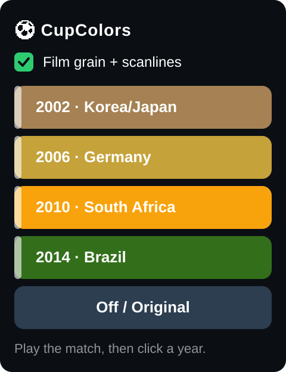

# ⚽ CupColors

A browser extension that paints your live World Cup stream with the colors of a
past tournament. Works on any HTML5 player (RTVE Play, DAZN, etc.) because it
just filters the `<video>`.

## Looks
Each era is tuned to its real broadcast technology, not a random filter:
- **2002 · Korea/Japan** — soft, washed, cool tones of standard-definition TV
- **2006 · Germany** — the first all-HD World Cup: clean, crisp, warm
- **2010 · South Africa** — bright, golden, saturated African-sun colors
- **2014 · Brazil** — vivid tropical HD/4K, the sharpest of them all

Optional **film grain + scanlines** add an old-broadcast feel (toggle in the
popup, heaviest on 2002). Turn it off for color only.

## Install (Chrome/Edge/Brave)
1. Go to `chrome://extensions`
2. Turn on **Developer mode** (top right)
3. **Load unpacked** → pick this folder
4. Pin the ⚽ icon

## Use
Play the match, click the ⚽ icon, click a year. The look appears instantly.
**Off / Original** restores it. That's it.

> Firefox: load via `about:debugging` → This Firefox → Load Temporary Add-on → pick `manifest.json`.

## Tweak a look
All four filters live in `presets.mjs` — edit the CSS `filter` strings.
Run `node test.mjs` to check they're still valid.

## Privacy
Collects no data. It only applies CSS filters to the page you're watching and
remembers your grain on/off choice locally. Nothing is sent anywhere.
